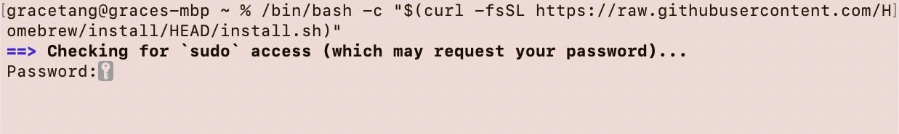
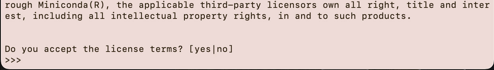
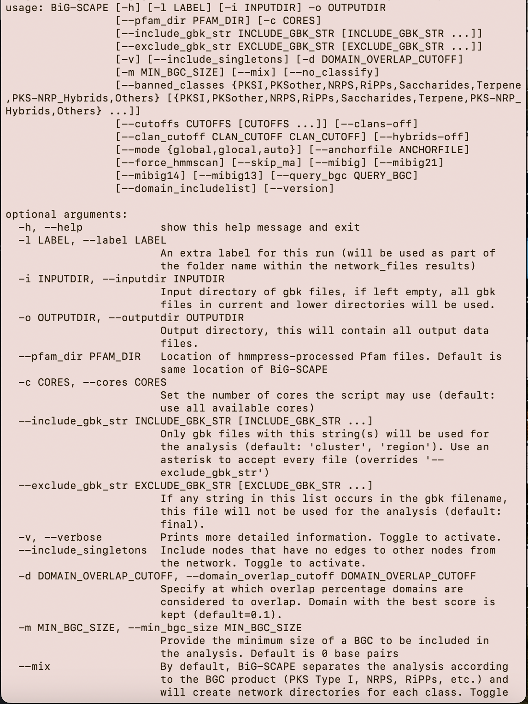

<h1> Installation Guide </h1>

__Please read through this entire guide before getting started as it will save you a lot of time troubleshooting errors later on__. 

Even if you have never installed similar softwares on your computer before, you should be able to install BiG-SCAPE _as long as you read this guide thoroughly_.

## Installation Steps

Follow the links for your platform __do not use Windows instructions for Mac or vice-versa__. These steps are _dependent on each other_ so follow them sequentially.

For __Mac__:

1. [🍻 Brew Installation](#-brew-installation-mac)
2. [🐍 Miniconda Installation](#-miniconda-installation-mac)
3. [⚙️ BiG-SCAPE Installation](#%EF%B8%8F-big-scape-installation-mac)

For __Windows__:

1. [🐧 WSL Installation](#-wsl-installation-windows)
2. [🐍 Miniconda Installation](#-miniconda-installation-windows)
3. [⚙️ BiG-SCAPE Installation](#%EF%B8%8F-big-scape-installation-windows)

## Terminal, Powershell, and Ubuntu

For __Mac__ based installation instructions you will exclusively be using the `terminal` application to interact with your computer.

For __Windows__ based installation instructions you will be using both `PowerShell` and `ubuntu` at any given step.

| <!-- -->    |  <!-- -->   |
|---	|---	|
| To open the `terminal` - click the Launchpad icon in the Dock, type `terminal` in the search field, then click `terminal`.	|  	|
| To open the `PowerShell` - open the Start menu, type `Windows PowerShell`, select `Windows PowerShell`, then select __Run as Administrator__. 	|  	|
| To open the `ubuntu` application -  open the Start menu, type `ubuntu`, select `ubuntu`, then select __Open__. 	|  	|

## "How To Use" This Guide

- Unless otherwise specified, use the copy button feature on GitHub __ONLY__, do not attempt to manually type commands into your terminal or powershell.

- When editing text in the terminal window you __cannot highlight__ a particular area __and delete__ with your keyboard. Instead to delete a portion of your command you must use your left arrow and navigate to the portion you want to edit

- If commands are expected to take a long time to complete they will be indicated with this icon ⌛. This means that either you should wait until a confirmation/continue action or wait until you can type again. You should see something like this when you are able to type again:

__For Macbook Pro__
```
(base) username@your-mbp ~ % |
```
__For Macbook Air__
```
(base) username@your-air ~ % |
```

__For a Windows Computer (Powershell)__
```
PS C:\Users\username> |
```

__For a Windows Computer (Ubuntu)__
```
(base) username@Name:~$ |
```

# Mac Based Installation

Follow these instructions __only__ if you are using a Mac. The expectation is that you first do `brew` installation, then `conda` installation, and finally `bigscape` installation.

## 🍻 Brew Installation (Mac)

<p align="center">
   
</p>

1) Check if `brew` is already installed on your computer. Open your `terminal`  application ``` (Finder > Application > Terminal) ``` and paste into your terminal:

```bash
brew -v
```

2) If `brew` is already installed, you will see a message similar to the one below (versions can differ). Proceed to the [Miniconda Installation](#-miniconda-installation-mac) section.

```bash
Homebrew 4.3.7
```

3) If you see the message below - proceed to step 4:

```bash
zsh: command not found: brew
```

4) ⌛ Copy and paste the following command into your `terminal` and click `return`:

```bash
/bin/bash -c "$(curl -fsSL https://raw.githubusercontent.com/Homebrew/install/HEAD/install.sh)"
```

between 4 and 5 you have to add press enter

5) When prompted for your __password__ as seen below, type your computer login password.

<p align="center">
  
</p>

> [!NOTE]
> You will not be able to see the information you type, so just type your password and click return 

6) ⌛ The installation will ask you to click `return` to continue:

<p align="center">
  
</p>


7) Paste into your terminal - replace `bigscape` with your username - the command is explicitly printed by the brew installation during the mention of __next steps__:

<p align="center">
  
</p>

```bash
 (echo; echo 'eval "$(/opt/homebrew/bin/brew shellenv)"') >> /Users/bigscape/.zprofile
```

8) Paste into your terminal:

```bash
eval "$(/opt/homebrew/bin/brew shellenv)"
```

9) Check if `brew` is successfully installed on your computer. Paste:

```bash
brew -v
```

10) If `brew` is successfully installed, you will see a message similar to the one below (versions can differ). Proceed to the [Miniconda Installation](#-miniconda-installation-mac) section.

```bash
Homebrew 4.3.7
```
 
## 🐍 Miniconda Installation (Mac)

> [!WARNING]  
> __Follow the file download instructions very carefully! If you don't download the right file, there will be lots of troubleshooting.__

> [!NOTE]
> Miniconda is also refered to as `conda` and those terms will be used interchangibly in this installation guide.

<p align="center">
  
  <br>
  <em>Accidentally clicked the wrong installer in demo, but downloaded the correct one. Use the one referenced in the guide.</em>
</p>

1) Check if conda is already installed on your computer. Paste in your `terminal`  :

```bash
conda -V
```

2) If the `conda` is already installed, you will see a message similar to the one below (versions can differ). Proceed to the [BiG-SCAPE Installation](#%EF%B8%8F-big-scape-installation-mac) section.

```bash
conda 24.5.0
```

3) If the `conda` is __not__ installed, then you will see the message below - proceed to step 4:

```bash
zsh: command not found: conda
```

4) Navigate to [this link](https://docs.anaconda.com/miniconda/#latest-miniconda-installer-links) and download the installer version as specificied in the images __DO NOT SELECT ANY OTHER INSTALLER__. Click the link under the _Name_ field to begin installation

<p align="center">
  
</p>
   

5) Open a new `terminal` window and copy-paste the command below:

```bash
cd downloads
```
 
6) ⌛ Paste into your terminal:

```bash
bash Miniconda3-latest-MacOSX-x86_64.sh
```

7) You will now be prompted for a series of agreements that you must accept from your terminal. These are included below:

<p align="center">
  
  <br>
  <em>Here type the word 'yes' and click enter </em>
</p>

<p align="center">
  
  <br>
  <em>⌛⌛⌛ When you see the Terms of Service (TOS) use your down arrow key to get through the text</em>
</p>

<p align="center">
  
   <br>
  <em>After you finish scrolling through the TOS type the word 'yes' to move on</em>
</p>

<p align="center">
  
   <br>
  <em>⌛ Complete the installation by clicking the 'return' key</em>  
</p>

8) Close your `terminal` window and open a __new__ `terminal` window.

9) Check if conda is successfully installed on your computer. Paste in your `terminal`:

```bash
conda -V
```

10) If the `conda` is sucessfully installed, you will see a message similar to the one below (versions can differ). Proceed to the [BiG-SCAPE Installation](#%EF%B8%8F-big-scape-installation-mac) section.

```bash
conda 24.5.0
```

## ⚙️ BiG-SCAPE Installation (Mac)

<p align="center">
   
</p>

1) Open a new `terminal`   window.

2) Paste into your terminal:

```bash
cd Desktop && mkdir bigscape && cd bigscape
```
3) Paste into your terminal:

```bash
brew install wget
```

4) ⌛ Paste into your terminal:

```bash
wget https://github.com/medema-group/BiG-SCAPE/archive/refs/tags/v1.1.5.zip
```
5) Paste into your terminal:

```bash
unzip v1.1.5
```
6) Paste into your terminal:
```bash
cd BiG-SCAPE-1.1.5
```
7) ⌛ Paste into your terminal:

```bash
conda env create -f bigscape_dependencies.yml
```

8) Finally, copy and paste the command below. You will see a change in your terminal after this completes with a `(bigscape)` in the beginning of your line:

```bash
conda activate bigscape
```

<p align="center">
  
</p>

9) Validate the installation by pasting the command below:

```bash
python bigscape.py --version
```
10) ⌛ Paste into your terminal:

```bash
wget https://ftp.ebi.ac.uk/pub/databases/Pfam/current_release/Pfam-A.hmm.gz && gunzip Pfam-A.hmm.gz
```

11) ⌛ Paste into your terminal:
```bash
hmmpress Pfam-A.hmm
```

12) You should now be able to run BiG-SCAPE, perform one last verification step and copy-paste the command below to see the options for running `bigscape`. _Make sure that your terminal has the `(bigscape)` in the beginning of your line:

```bash
python bigscape.py -h
```

<p align="center">
   
  <br>
<em>You should see this list of commands that you can use on your bigscape query.</em>
</p>

# Windows Based Installation

Follow these instructions __only__ if you are using a Windows machine. The expectation is that you first do `wsl` installation, then `conda` installation, then `bigscape` installation.

## 🐧 WSL Installation (Windows)

<p align="center">
   
</p>

1) Check if `wsl` is already installed on your computer by looking through your applications and see if there is an  `ubuntu`  application on your machine.

2) If you see `ubuntu` on your machine proceed to the [Miniconda Installation](#-miniconda-installation-windows) section.

3) If you cannot find the `ubuntu` application proceed to step 4.

4) Find your __Windows PowerShell__  application and _run as administrator_. You will be asked to confirm if you "want to allow this app to make changes to your device" - click yes.

<p align="center">
  
</p>

6) ⌛ Paste into your `powershell`:

```bash
wsl --install Ubuntu --web-download
```

6) When you see the below message __restart your computer__ and log back in to your account:

```
Enter new UNIX username: _
```

7) After your computer restarts, the `ubuntu` application should now be available, open the application to verify a successful install.

8) You can now close the `ubuntu` app and proceed to [Miniconda Installation](#-miniconda-installation-windows)

## 🐍 Miniconda Installation (Windows)

> [!WARNING]  
> __Follow the file download instructions very carefully! If you don't download the right file, there will be lots of troubleshooting.__

> [!NOTE]
> Miniconda is also refered to as `conda` and those terms will be used interchangibly in this installation guide.

<p align="center">
   
</p>

1) Check if conda is already installed on your computer. Paste in your `ubuntu`  :

```bash
conda -V
```

2) If the `conda` is already installed, you will see a message similar to the one below (versions can differ). Proceed to the [BiG-SCAPE Installation](#%EF%B8%8F-big-scape-installation-windows) section.

```bash
conda 24.5.0
```

3) If the `conda` is __not__ installed, then you will see the message below - proceed to step 4:

```bash
conda: command not found
```

4) Navigate to [this link](https://docs.anaconda.com/miniconda/#latest-miniconda-installer-links) and download the installer version as specificied in the images __DO NOT SELECT ANY OTHER INSTALLER__. Click the link under the _Name_ field to begin installation

<p align="center">
  
</p>

5) Open a new `ubuntu` window and copy-paste the command below:

```bash
WINDOWS_USER=$(/mnt/c/Windows/System32/cmd.exe /c 'echo %USERNAME%' | sed -e 's/\r//g')
```

6) Copy-paste the command below:

```bash
cd ../../mnt/c/Users/$WINDOWS_USER/Downloads
```

7) ⌛ Paste into your ubuntu:

```bash
bash Miniconda3-latest-Linux-x86_64.sh
```

8) You will now be prompted for a series of agreements that you must accept from your `ubuntu`. These are included below:

<p align="center">
  
  <br>
  <em>Here click enter </em>
</p>

<p align="center">
  
  <br>
  <em>When you see the Terms of Service (TOS) use your down arrow key to get through the text</em>
</p>

<p align="center">
  
   <br>
  <em>After you finish scrolling through the TOS type the word 'yes' to move on</em>
</p>

<p align="center">
  
   <br>
  <em>Confirm the installation by clicking the 'return' key</em>  
</p>

<p align="center">
  
   <br>
  <em>Finalize the installation by typing 'yes' and clicking enter</em>  
</p>


9) Close your `ubuntu` window and open a __new__ `ubuntu` window.

10) Check if conda is successfully installed on your computer. Paste in your `ubuntu`:

```bash
conda -V
```

11) If the `conda` is sucessfully installed, you will see a message similar to the one below (versions can differ). Proceed to the [BiG-SCAPE Installation](#%EF%B8%8F-big-scape-installation-windows) section.

```bash
conda 24.5.0
```

## ⚙️ BiG-SCAPE Installation (Windows)

<p align="center">
   
</p>

1) Open a new `ubuntu`   and copy-paste the command below:

```bash
WINDOWS_USER=$(/mnt/c/Windows/System32/cmd.exe /c 'echo %USERNAME%' | sed -e 's/\r//g')
```

2) Copy-paste the below command:

```bash
cd ../../mnt/c/Users/$WINDOWS_USER/Documents && mkdir bigscape && cd bigscape
```
3) ⌛ Paste into your ubuntu:

```bash
wget https://github.com/medema-group/BiG-SCAPE/archive/refs/tags/v1.1.5.zip
```

4) Copy-paste into your `ubuntu`:

```bash
sudo apt install unzip
```

5) Paste the below command:

```bash
unzip v1.1.5
```

6) Paste into your terminal:
```bash
cd BiG-SCAPE-1.1.5
```

7) ⌛ Paste into your terminal:

```bash
conda env create -f bigscape_dependencies.yml
```

8) Finally, copy and paste the command below. You will see a change in your terminal after this completes with a `(bigscape)` in the beginning of your line:

```bash
conda activate bigscape
```

<p align="center">
  
</p>

9) Validate the installation by pasting the command below:

```bash
python bigscape.py --version
```
10) ⌛ Paste into your terminal:

```bash
wget https://ftp.ebi.ac.uk/pub/databases/Pfam/current_release/Pfam-A.hmm.gz && gunzip Pfam-A.hmm.gz
```

11) ⌛ Paste into your terminal:
```bash
hmmpress Pfam-A.hmm
```

12) You should now be able to run BiG-SCAPE, perform one last verification step and copy-paste the command below to see the options for running `bigscape`. _Make sure that your terminal has the `(bigscape)` in the beginning of your line:

```bash
python bigscape.py -h
```

<p align="center">
   
  <br>
<em>You should see this list of commands that you can use on your bigscape query.</em>
</p>

